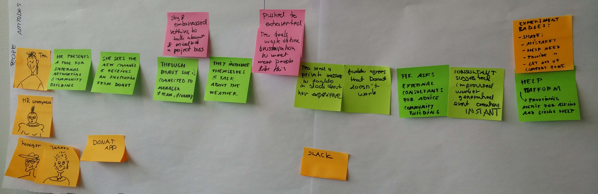
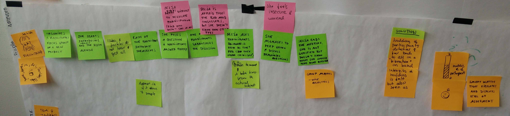
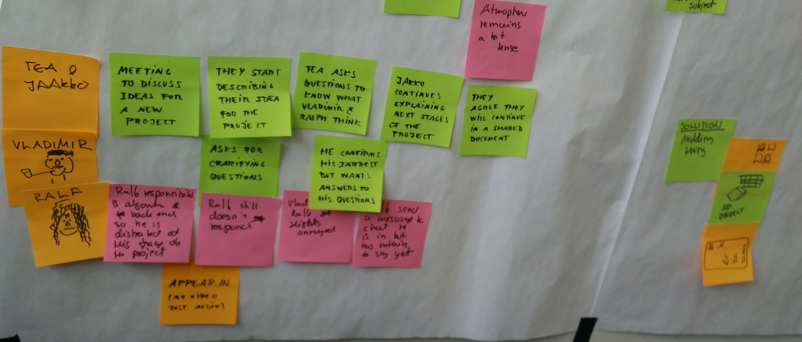

# Journey maps on the following scenarios of use:

* Community building through Instant Messaging
* Showing engagement (presence) in an online focus group using video-conferencing (audio, no video)
* Supporting shared understanding among groups using online video-conferencing (audio, no video)

{:height="95%" width="95%"}
Format: 

{:height="95%" width="95%"}
Format: 

{:height="95%" width="95%"}
Format: 
